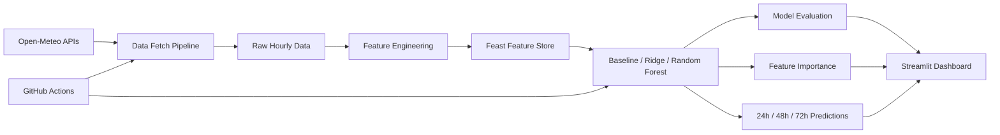

# Pearls AQI Predictor

End-to-end Karachi Air Quality Index forecasting for the next 24, 48, and 72 hours.

[Open Live Dashboard](https://pearls-aqi-predictor-8eluvoxqdhfnpt5iyzfogl.streamlit.app) | [Read Final Report](reports/final_report.md) | [View EDA Summary](reports/eda_summary.md)

## Overview

This project fetches hourly weather and pollutant data, creates forecasting features, stores reusable features in Feast, compares three model approaches, generates three-day AQI forecasts, explains model drivers, and presents results in a deployed Streamlit dashboard.

## Architecture



## Implemented Stack

- Python 3.12
- Pandas and NumPy
- Scikit-learn
- Matplotlib
- Streamlit Community Cloud
- GitHub Actions
- Open-Meteo Weather and Air Quality APIs
- Feast feature store with Parquet offline storage and SQLite online storage
- Random Forest feature importance with optional SHAP support

## Current Results

Training uses a chronological 80/20 split.

| Horizon | Selected Model | MAE | RMSE | R2 |
| --- | --- | ---: | ---: | ---: |
| 24h | Current AQI baseline | 8.90 | 11.30 | 0.492 |
| 48h | Random Forest | 12.77 | 17.04 | -0.191 |
| 72h | Random Forest | 14.87 | 20.55 | -0.841 |

The 24-hour baseline is strongest on the latest 90-day window. Random Forest performs best among the tested models at 48 and 72 hours, but negative long-range R2 values show that more historical data is needed.

Latest committed demo forecast:

| Horizon | Forecast Time | Predicted AQI | Category |
| --- | --- | ---: | --- |
| 24h | 07 Jun 2026, 11:00 PM | 78.00 | Moderate |
| 48h | 08 Jun 2026, 11:00 PM | 72.35 | Moderate |
| 72h | 09 Jun 2026, 11:00 PM | 92.03 | Moderate |

## Features

- Hour, weekday, day, month, and weekend indicators
- AQI, pollutant, and weather lags from 1 to 72 hours
- Rolling means and standard deviations from 3 to 72 hours
- AQI and particulate change features
- Separate 24h, 48h, and 72h targets
- AQI category and hazardous-level alerts
- Model metrics and forecast-driver visualization

## Project Structure

```text
app/                  Streamlit dashboard
data/                 Dashboard snapshot and generated pipeline data
models/               Model metadata and local trained models
reports/              Final report, EDA summary, and figures
src/                  Data, feature, training, explanation, and prediction scripts
feature_repo/         Feast definitions and generated local stores
.github/workflows/    Hourly prediction and daily training automation
```

## Run Locally

```powershell
python -m venv .venv
.\.venv\Scripts\Activate.ps1
python -m pip install -r requirements.txt

python src\fetch_data.py
python src\features.py
python src\feature_store.py
python src\train.py
python src\explain.py
python src\predict.py
python src\eda.py
python src\export_report.py

python -m streamlit run app\streamlit_app.py
```

Open `http://localhost:8501`.

## Feature Store

The project includes a local Feast feature store for reproducible training and
online inference features. It uses:

- `karachi` as the entity with `city_id` as its join key
- Parquet as the offline historical store
- SQLite as the online low-latency store
- 13 AQI, pollutant, weather, lag, rolling, and change features
- `aqi_forecast_service` as the shared model feature service

Install and build it after generating the processed feature CSV:

```powershell
python -m pip install -r requirements-feature-store.txt
python src\features.py
python src\feature_store.py
```

The command registers the definitions, materializes the online store, performs
historical and online lookups, and writes a verification result to
`data/processed/feature_store_demo.json`.

## Automation

Three GitHub Actions workflows are included:

- **Hourly AQI Predictions:** refreshes data/features and generates forecasts.
- **Daily AQI Model Training:** refreshes data, retrains models, creates explanations, and generates forecasts.
- **Build AQI Feature Store:** manually builds, materializes, verifies, and uploads the Feast store artifacts.

The workflows upload generated data, model, and feature-store files as downloadable artifacts.

## Reports

- [Final project report](reports/final_report.md)
- [Final report PDF](reports/Pearls_AQI_Predictor_Final_Report.pdf)
- [EDA summary](reports/eda_summary.md)
- [Submission checklist](reports/submission_checklist.md)
- [EDA figures](reports/figures)

## Scope Notes

- The public Streamlit app uses a committed data snapshot so it can open immediately.
- GitHub Actions generate fresher artifacts, but do not currently write them back to the deployed app.
- A local Feast feature store is implemented. A production model registry and longer historical dataset remain future improvements.
