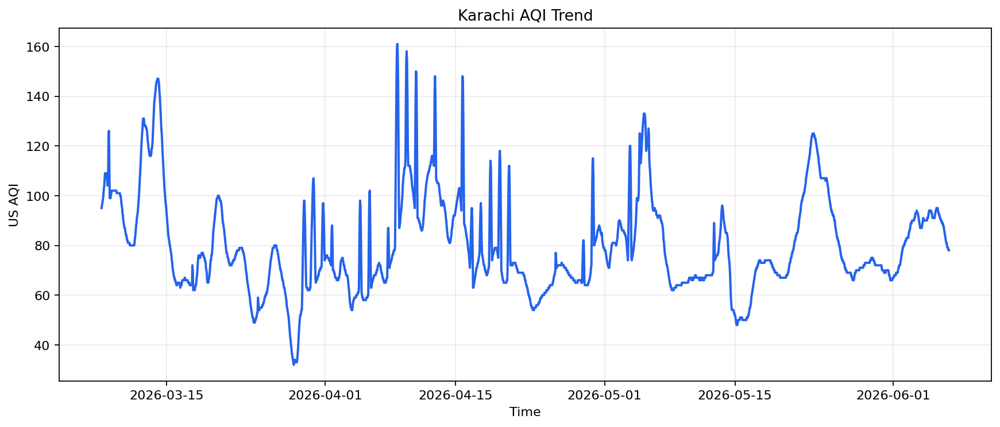
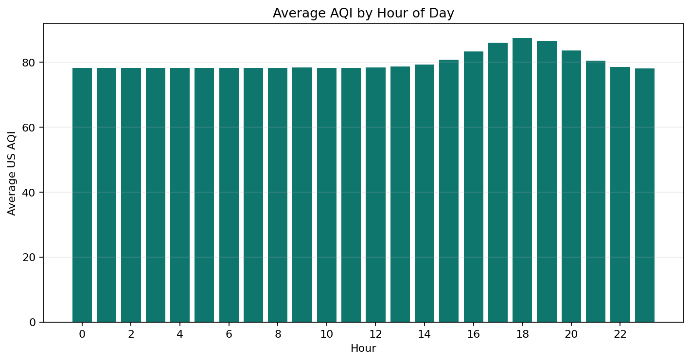
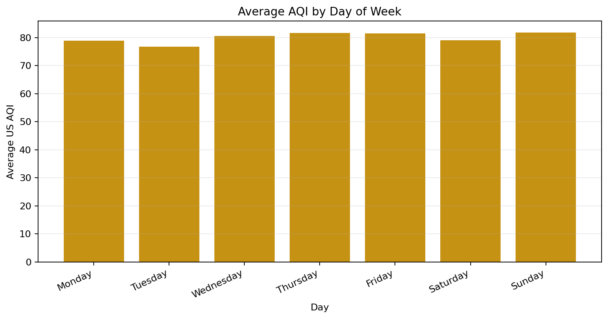
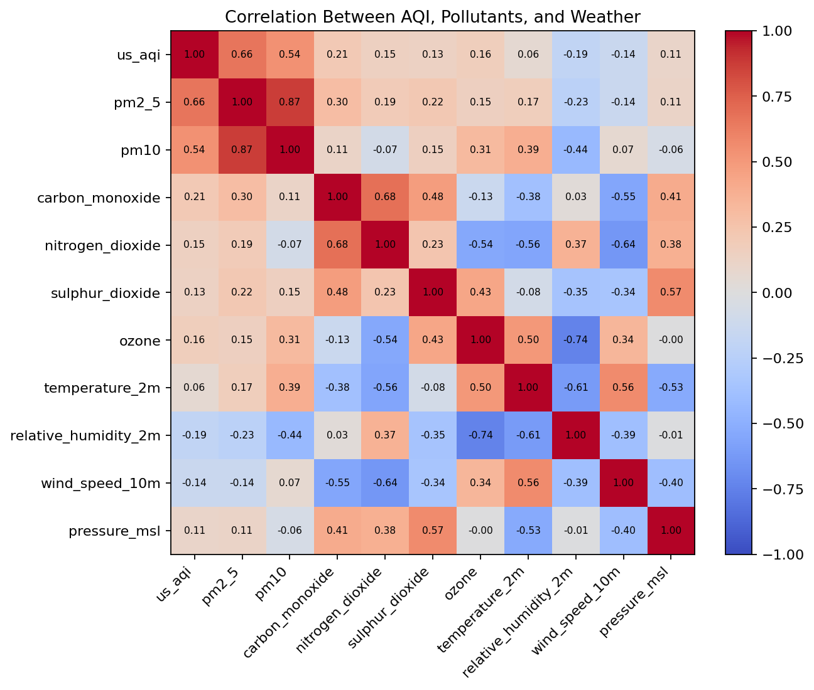
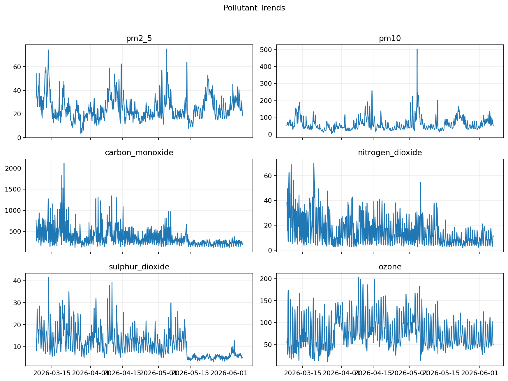

# Pearls AQI Predictor Final Report

## 1. Introduction

Pearls AQI Predictor is an end-to-end air quality forecasting system for Karachi, Pakistan. The project predicts Air Quality Index values for the next 24, 48, and 72 hours using recent pollutant, weather, and time-based features.

The system includes data fetching, feature engineering, model training, prediction generation, model explanation, dashboard visualization, and GitHub Actions automation.

## 2. Problem Statement

Air pollution can change quickly due to weather conditions, pollutant concentration, and time-based activity patterns. The objective of this project is to build a forecasting pipeline that can estimate near-future AQI and present the result in a simple dashboard for monitoring and decision support.

## 3. Data Source

The project uses Open-Meteo APIs for Karachi:

- Weather archive data
- Air quality and pollutant data

The final dashboard snapshot contains 2,184 hourly rows from 08 Mar 2026 to 06 Jun 2026.

Main variables:

- US AQI
- PM2.5
- PM10
- Carbon monoxide
- Nitrogen dioxide
- Sulphur dioxide
- Ozone
- Temperature
- Relative humidity
- Wind speed and direction
- Pressure
- Cloud cover

## 4. System Architecture

```text
Open-Meteo APIs
      |
      v
src/fetch_data.py
      |
      v
Raw CSV data
      |
      v
src/features.py
      |
      v
Training feature dataset
      |
      +--> src/train.py --> trained models + metrics
      |
      +--> src/explain.py --> feature importance
      |
      +--> src/predict.py --> latest 3-day AQI forecasts
      |
      v
Streamlit dashboard
```

Automation is handled through GitHub Actions:

- Hourly prediction workflow
- Daily model training workflow

## 5. Feature Engineering

The feature engineering pipeline creates:

- Time features: hour, day of week, day of month, month, weekend flag
- Lag features: 1h, 3h, 6h, 12h, 24h, 48h, 72h
- Rolling statistics: 3h, 6h, 12h, 24h, 48h, 72h rolling mean and standard deviation
- Change features: AQI and pollutant changes over time
- Forecast targets:
  - `target_aqi_24h`
  - `target_aqi_48h`
  - `target_aqi_72h`

The processed training dataset contains 2,040 clean rows and 188 columns.

## 6. Exploratory Data Analysis

EDA found:

- Rows analyzed: 2,184
- Missing values: 0
- Mean AQI: 80.01
- Minimum AQI: 32
- Maximum AQI: 161

AQI category counts:

| Category | Count |
| --- | ---: |
| Good | 57 |
| Moderate | 1,807 |
| Unhealthy for Sensitive Groups | 314 |
| Unhealthy | 6 |
| Very Unhealthy | 0 |
| Hazardous | 0 |

Generated EDA figures:











## 7. Models Used

Three model approaches were used:

| Model | Purpose |
| --- | --- |
| Current AQI baseline | Benchmark that assumes future AQI equals current AQI |
| Ridge Regression | Linear regularized model |
| Random Forest Regressor | Non-linear tree-based model |

## 8. Model Evaluation

Evaluation used a time-based train/test split to avoid future leakage. Metrics used:

- MAE
- RMSE
- R2

Results:

| Target | Model | MAE | RMSE | R2 |
| --- | --- | ---: | ---: | ---: |
| 24h | Current AQI baseline | 8.90 | 11.30 | 0.492 |
| 24h | Random Forest | 9.20 | 12.16 | 0.412 |
| 24h | Ridge | 10.34 | 13.72 | 0.251 |
| 48h | Random Forest | 12.77 | 17.04 | -0.191 |
| 48h | Current AQI baseline | 14.78 | 19.54 | -0.566 |
| 48h | Ridge | 16.33 | 20.39 | -0.706 |
| 72h | Random Forest | 14.87 | 20.55 | -0.841 |
| 72h | Current AQI baseline | 19.09 | 24.89 | -1.701 |
| 72h | Ridge | 30.86 | 34.68 | -4.244 |

The current-AQI baseline performed best at 24 hours. Random Forest performed best among the tested models at 48 and 72 hours. The negative R2 values at longer horizons indicate that the current 90-day dataset is not sufficient for strong long-range forecasting.

## 9. Latest Forecast Snapshot

The final forecast snapshot was generated from the 06 Jun 2026, 11:00 PM observation.

| Horizon | Forecast Time | Model | Current AQI | Predicted AQI | Category |
| --- | --- | --- | ---: | ---: | --- |
| 24h | 07 Jun 2026, 11:00 PM | Current AQI baseline | 78 | 78.00 | Moderate |
| 48h | 08 Jun 2026, 11:00 PM | Random Forest | 78 | 72.35 | Moderate |
| 72h | 09 Jun 2026, 11:00 PM | Random Forest | 78 | 92.03 | Moderate |

## 10. Explainability

The project includes `src/explain.py`, which generates feature importance values for forecast models.

For the local environment, Random Forest feature importance is used. The script is also written to use SHAP when SHAP is installed and available.

The selected 24h model is the baseline and does not expose tree-based feature importance. Top drivers for the 48h Random Forest model include:

- Day of month
- Wind speed rolling mean over 48h
- PM2.5 rolling mean over 6h
- Temperature rolling mean over 48h
- PM10 rolling mean over 72h

These values are displayed in the dashboard under the Forecast drivers section.

## 11. Dashboard

The Streamlit dashboard includes:

- Current AQI and AQI category
- Pollutant profile
- 24h, 48h, and 72h forecasts
- Observed and forecast AQI charts
- Model evaluation
- Feature importance
- Automated pipeline overview

Live dashboard:

https://pearls-aqi-predictor-8eluvoxqdhfnpt5iyzfogl.streamlit.app

## 12. Automation

The project includes two GitHub Actions workflows:

| Workflow | Purpose |
| --- | --- |
| Hourly AQI Predictions | Fetch data, build features, create fallback models if needed, explain models, and generate predictions |
| Daily AQI Model Training | Fetch data, build features, train models, explain models, and generate predictions |

Both workflows were manually tested successfully. Artifacts are uploaded after workflow runs.

## 13. Limitations

- The current model uses around 3 months of data.
- Longer historical data would improve seasonal learning.
- The deployed dashboard uses a committed data snapshot for easy public demo access.
- A production version should use a feature store and model registry.
- The 48h and 72h forecasts have negative R2 values on the latest test window.

## 14. Future Work

- Add 1-2 years of historical training data.
- Integrate Hopsworks Feature Store.
- Store trained models in a proper model registry.
- Add full SHAP visualizations.
- Add multi-city support.
- Improve model selection with XGBoost or LightGBM.
- Deploy an automated data refresh backend for Streamlit Cloud.

## 15. Conclusion

The project successfully implements an end-to-end AQI prediction system with data ingestion, feature engineering, model training, prediction generation, explainability, automation, and dashboard deployment. The latest evaluation demonstrates that model selection changes by horizon and data window: the baseline is strongest at 24 hours, while Random Forest is selected at 48 and 72 hours. Longer historical coverage is the most important next step for improving forecast reliability.
